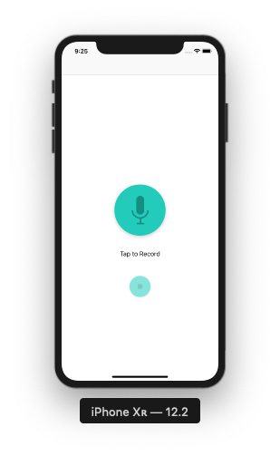

# Pitch Perfect

Pitch Perfect is an app that records a user’s voice and then plays the modulated audio through a variety of filters.

## Screenshots
| Home Screen: Idle | Home Screen: Recording | Play Sounds Screen |
| ----------------- | ---------------------- | ------------------ |
|  |  | 

## Languages
Swift 5

## Xcode Version

Xcode 10.2

## Frameworks Used
1. [Foundation](https://developer.apple.com/documentation/foundation)
2. [UIKit](https://developer.apple.com/documentation/uikit)
3. [AVFoundation](https://developer.apple.com/documentation/avfoundation)

## How to Build
1. Download or fork & clone project on your desktop.
2. Open `Pitch Perfect.xcodeproj` file in Xcode.
3. Now you can build and run the app.

## Built With Udacity

* [Intro to iOS App Development with Swift](https://www.udacity.com/course/intro-to-ios-app-development-with-swift--ud585) 
